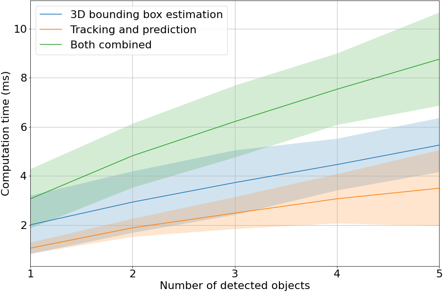

# ROS package for 3D object detection with tracking and trajectory prediction

## Overview
This package allows users to use any 2D object detector and depth camera to predict 3D bounding boxes of detected objects, as well as track their movement and predict their trajectories.

This version supports the Noetic distribution of ROS. The programs were tested using the Intel RealSense D435 camera and Noetic. Although Noetic is recommended to avoid compatibility issues with different versions of Python, Melodic can also be used but the user may need to change the Python path to avoid using Python 2. Detailed documentation about the various nodes and modules can be found in the corresponding Python scripts.

## Results
---
### Simulation demos (Robotont Gazebo)
<p align="center">
    
    <br>
    <sup>Demo with one detected object</sup>
</p>

<p align="center">
    
    <br>
    <sup>Demo with multiple detected objects</sup>
</div>

### Runtime analysis
<p align="center">
    
    <br>
    <sup>Computation time with regard to the number of detected objects. Highlighted areas are one standard deviation above and below the line. Measurements do not include the required 2D detecion.</sup>
</div>

## Installation instructions
To use this package, various dependencies must be met. Please install the _pyrealsense2_, _opencv-python_, and _numpy_ manually, using either _pip_ or _conda_. Rest of the dependencies should be solvable using _rosdep_.

Then, just clone this repository and use _catkin build_ to compile it.

In order to actually do useful work, a 2D detector has to publish the 2D bounding box information to a specified topic. To acquire the 2D detector, please clone the [ros_yolo repository](https://github.com/Jyrijoul/ros_yolo) and follow the instructions provided.

This package can be used with any image source, for example an Intel RealSense depth camera or its simulated version. For detailed installation instructions for the real camera, go to https://github.com/IntelRealSense/realsense-ros and preferably go with _Method 1: The ROS distribution_ under the _Installation Instructions_.

## Usage instructions

This package is composed of two main nodes: the main node and the tracker node. Both of them have separate launch files (_main.launch_ and _tracker.launch_, respectively) and configuration files (_config_main.yaml_ and _config_tracker.yaml_, respectively). The main node is used for parsing the 2D bounding boxes and depth images to create 3D bounding boxes and publish them. The tracker node is responsible for tracking the 3D bounding boxes, predicting their trajectories, and outputting visualization information to be seen in, for example, RViz.

Both the launch files and configuration files enable extensive configuration of the nodes, using the ROS parameter server and topic remapping. Be sure to check them out and see what options there are. In addition to the documentation found in these files, the Python scripts can often offer more extensive documentation.

### Simulation with Robotont
For using this node with a simulated Robotont robot, first install the necessary packages, such as [robotont_gazebo](https://github.com/robotont/robotont_gazebo) and its dependencies. Then, use ```gazebo.launch``` from the _ros_3d_bb_ package to run the simulation with a provided world. To control the robot, run ```rosrun teleop_twist_keyboard teleop_twist_keyboard.py```. Finally, it is recommended to use ```roslaunch ros_3d_bb simulation.launch```, using a top-level launch file to launch all the necessary _ros_3d_bb_ and _ros_yolo_ nodes to perform 3D object detection, tracking, and trajectory prediction.

### Real camera
If using a real camera, (eg Intel RealSense D435), use ```roslaunch ros_3d_bb realsense.launch``` to start the camera feed and all the necessary _ros_3d_bb_ and _ros_yolo_ nodes to perform 3D object detection, tracking, and trajectory prediction.